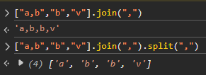

# 🚀 KS_JS_API
Connect KrunkScript with JavaScript & send string messages back and forth! <br>

 

KrunkScript is a custom scripting language developed by the popular browser game [Krunker.io](https://krunker.io) for adding more logic to custom games.
<br> [Original KrunkScript docs](https://docs.krunker.io/#/./files/scripting) <br> 
[Better KrunkScript docs by Swat Doge](https://krdocs.swatdoge.eu/home.html)

## 🤓 ***How does this work?***
**⚡ Credits to [j4k0b](https://github.com/j4k0xb) for the better updated code! ⚡**
> Originally in [v1.0.0](https://github.com/BluZed/KS_JS_API/releases/tag/v1.0.0) I was using a rather slow and tedious method that involved converting the string into a binary representation of it's character's indexes in a predefined array of characters and then clicking divs a lot of times to transfer that binary information to KS. 
It was unstable and did not fully support sending every character to KS as the characters were predefined and limited. 
Jakob solved this issue entirely by his novel method of using GAME.UI.getDIVText and MutationObserver. Thank you Jakob! <3

KrunkScript allows adding custom divs with onclick event listeners in the browser dom & also getting the innerHTML of the div.

The onclick event listeners fire even if you click them through javascript i.e using the [.click()](https://developer.mozilla.org/en-US/docs/Web/API/HTMLElement/click) method on the element.

The KS code creates two divs, TX & RX. When RX is clicked, KS gets the message as the innerHTML of the RX div. 

The JS code listens to changes to the TX div using a [MutationObserver](https://developer.mozilla.org/en-US/docs/Web/API/MutationObserver). KS code updates the innerHTML of the TX div to send a message, which triggers the observer callback.

## ❓ ***How to use this?***
This can be used with the [Tampermonkey browser extension](https://www.tampermonkey.net/)  OR any Krunker client that supports userscripts (eg. [KraXen72/crankshaft](https://github.com/KraXen72/crankshaft)).
<br> (Optional) Add this in JavaScript script meta to make the API connect to KS as soon as possible.
```
// @run-at       document-start
```


**You should check-out the [example directory](./example/) for examples!**

I plan on making the KS part easier once they add the libraries feature to KS.

#### == KRUNKSCRIPT PART ==

Firstly the custom map should have the following code present in Scripting tab in the editor:

***`Client.krnk`***

**< Top of the file >**
```js
# Client Script runs only on the client
# KrunkScript Copyright (C) Yendis Entertainment Pty Ltd
# 
# Add custom actions here

str TX_ID = "KS_TX";
str RX_ID = "KS_RX";
action send_js_message(str msg) {
    GAME.UI.updateDIVText(TX_ID, "KS_flush");
    GAME.UI.updateDIVText(TX_ID, msg);
}

action on_js_message(str msg) {
    ######################################
    # do whatever u want with msg string #
    ######################################
    GAME.log("Message received: " + msg);
}
```
**< onDivClicked action > (modify if exists already)**
```js
# User clicked a DIV (ID)
public action onDIVClicked(str id) {
    if (id == RX_ID) {on_js_message(GAME.UI.getDIVText(RX_ID));}
    # ========= continue your code ===============
}
```
**< start action >  (modify if exists already)**
```js
# Runs when the game starts
public action start() {
    GAME.UI.addDIV(TX_ID, false);
    GAME.UI.addDIV(RX_ID, false);
    # ========= continue your code ===============
}
```
All of the above should be present for optimal functioning. 
It is reccomended to code in KrunkScript **AFTER** setting this up to avoid clashes between your code and this code and for better debugging.

#### == JAVASCRIPT PART ==
Secondly, add [this minified JS class function](./js.source.minified.js) in your JavaScript code at the bottom/top. (simply copy paste)
Unminified pretty source is available as [js.source.js](./js.source.js) file in this repo.
<br>

#### == SETUP COMPLETE ==
Now in your JavaScript code, you can do the following:
```js
const KS = new KS_CONNECTOR(); 
KS.onready = () => {
    KS.send("hello from js"); 
}
```

And in KrunkScript, you can do this whenever needed.
```js
send_js_message("message to send can be whatever u want")
```
To listen to messages from JS to KS, modify the existing `on_js_message` action that is present near the top of the KS code.

Checkout "Using LabelHandlerMgr" below to use label-data + callback methods.

# Using LabelHandlerMgr
I provide a LabelHandlerMgr class in the JS API that makes it easier to manage functions that get called according to label and with data sent from KS. This makes it easier to use the API without too much string manipulation. You may use it as you see fit.

There is one limitation of this however, you may not include a "," in any item of the data (label included) as it would split that item of the data array into two different items since , represents that there is a break at that index and the next characters belong to the next item. 
This happens both in KS and JS.

Eg. ["label,one","one","two"] would be converted to ["label","one","one","two"].



It should be fine as long as there is no ",". You may use any other character in place of a ",".

**> Sending an array from KS to JS**

To send data in the form of [label,data0,data1....]
Example KS:
```js
########## Method 1 ##########

str[] arrayToSend = str["test_label","hel","lo"]
send_js_message(((str)arrayToSend)+""); 

# brackets and the +"" is very important otherwise 
# KS adds unnecesarry characters without simply 
# converting the array into a comma seperated values string.

######### Method 2 ##########
# You may replace the original send_js_message action
# with the following one to directly accept an array of strings

action send_js_message(str[] msg) {
    GAME.UI.updateDIVText(TX_ID, "KS_flush");
    GAME.UI.updateDIVText(TX_ID, (((str)msg)+""));
}

send_js_message(str["test_label","hel","lo"]) # this now sends the array directly

```

Example JS:
```js
const KS = new KS_CONNECTOR();
KS.onready = () => {
    console.log("KS API Ready.")
}

const handlermgr = new KS.LabelHandlerMgr();
handlermgr.bindToAPI(KS);

handlermgr.addHandler("test_label",(data)=>{ 
    alert(data[0]+data[1]) 
})
```

Output of the above will result in a popup saying "hello" since we concatenate the two strings we get from data and [window.alert](https://developer.mozilla.org/en-US/docs/Web/API/Window/alert) it.

**> Sending an array from JS to KS**

Since you can only send strings with .send(), you will need to convert the array to a string and then parse it in KS.

Example JS:
```js
const KS = new KS_CONNECTOR();

KS.onready = () => {
    const arrayToSend = stringArray(["test1","data1","data2"])
    KS.send(arrayToSend)
}

// ["one","two","3"] -> "one,two,3"
function stringArray(array){return array.join(","); }
```

Example KS:
```js
# might have been easier if there was some UTILS.textSplit method
str[] action CommaSepStrToArray(str datastr){
    # If message only contains "," and nothing else return empty string array
    if(lengthOf (UTILS.replaceText(datastr, ",")) == 0){
        return str[];
    }
    str[] data = str[""];
    for(num i = 0; i < lengthOf datastr; i++){
        if(datastr[i] == ","){
            addTo data "";
        } else {
            data[(lengthOf data)-1] +=  datastr[i];
        }
    }
    return data;
}

action on_js_message(str msg) {
    ######################################
    # do whatever u want with msg string #
    ######################################
    GAME.log("Message received: " + msg);

    str[] array = CommaSepStrToArray(msg);
    GAME.log(array);
    # array is now the string array we sent via JS

}
```

# JS API Methods
```js
// i.e const KS = new KS_JS_API(...args...)
constructor(
    // default method to log text to console. default is console.log 
    // you dont need to change this so you may leave it blank.
    logfunc
)

// set a function as the value of this property.
// it will be called when the API is ready to send & recieve data.
// incase the API was already ready, function will be called instantly.
// by default it logs an error to the console if no function was set to it.
.onready 

.isReady // boolean representing whether the API is ready to send & recieve messages or not.

// sends a message to KS
.send([str] msg)

// set this to true/false if needed.
.disable // boolean representing whether or not to disable the API.

// set this to true/false if needed.
.disableLogs // boolean representing whether or not to disable api logs. some errors may still be logged.

// Class to handle messages from KS in the format [label, data0, data1, ...]
// See "Using LabelHandlerMgr" for more details
.LabelHandlerMgr
    constructor()

    .handlers = {} // object used to store callback functions. no need to modify anything in this.

    // call this with the KS_API object to use this class.
    .bindToAPI(
        // KS_API object
        api
    )

    .addHandler(
        // label of the handler to add
        [str] label,
        // callback function that has the data array passed as the only argument.
        [func] callback
    )

    .removeHandler(
        // label of the handler to remove
        [str] label
    )
```

# KS API METHODS 
In KrunkScript, you can do this whenever needed.
```js
send_js_message("message to send can be whatever u want")
```
To listen to messages *from* JS *to* KS, modify the existing **`on_js_message` action** that is present near the top of the KS code.

Check the example directory for more info.

# Contributing
> My discord is `bluzed`

So you found a bug? Raise an issue or contact me on discord.
Feature requests are welcome. 
If you can and want to fix any bug you are more than welcome to do so with a pull request.
